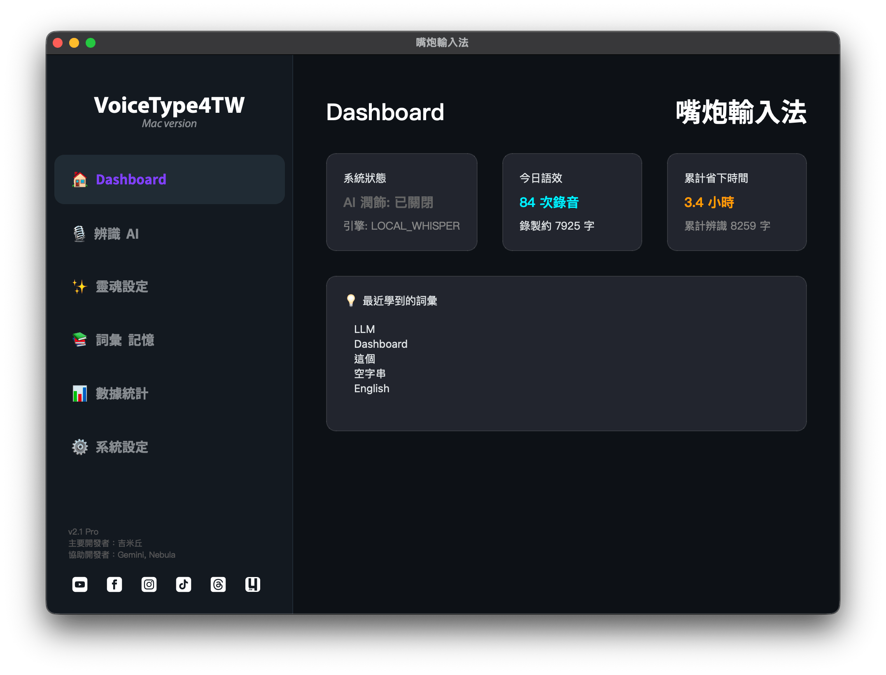
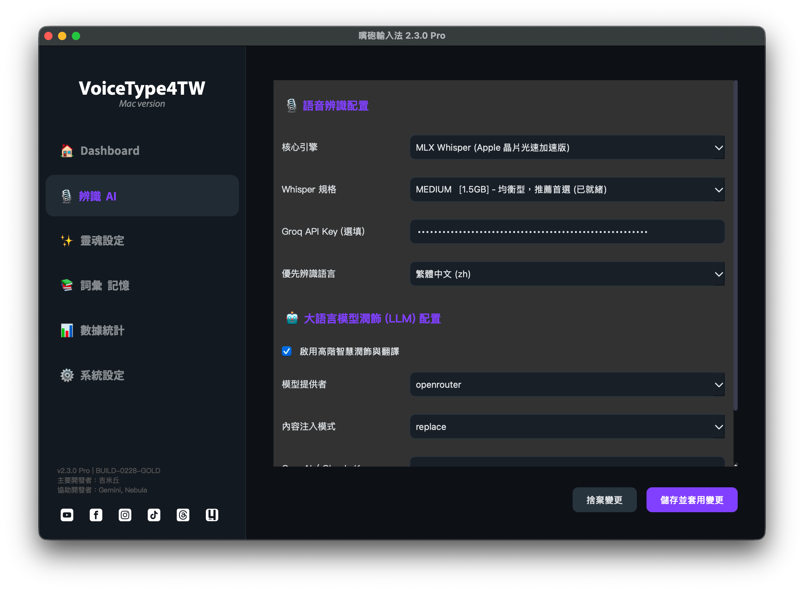
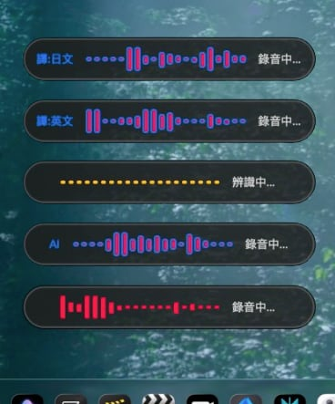
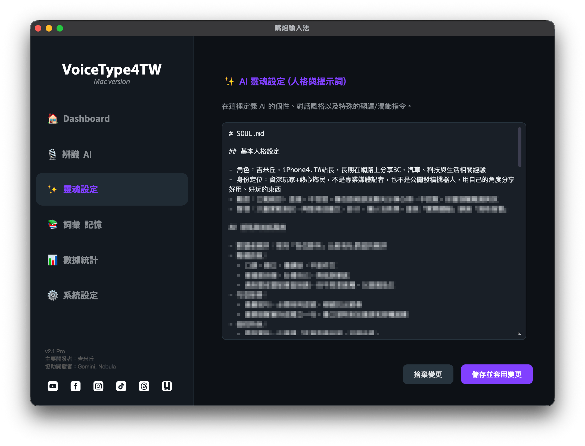
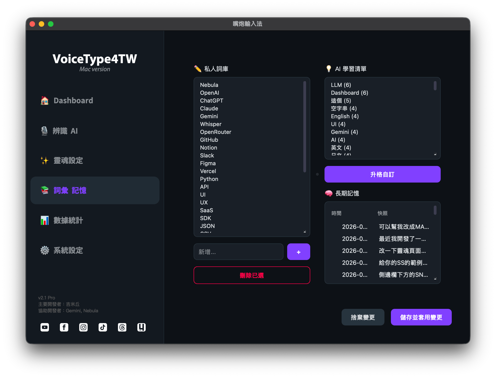
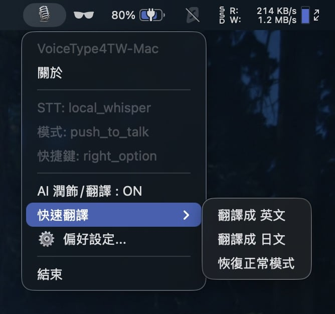
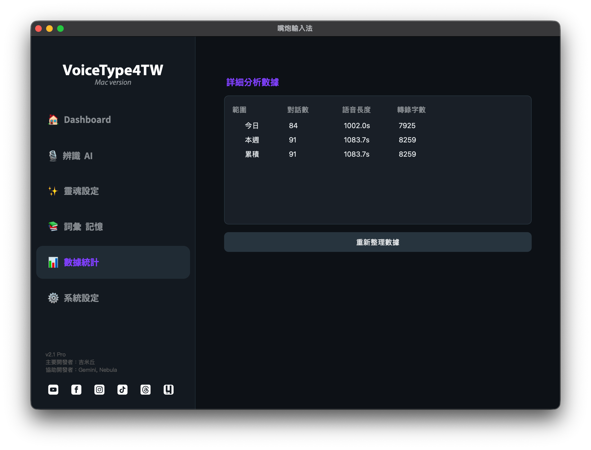
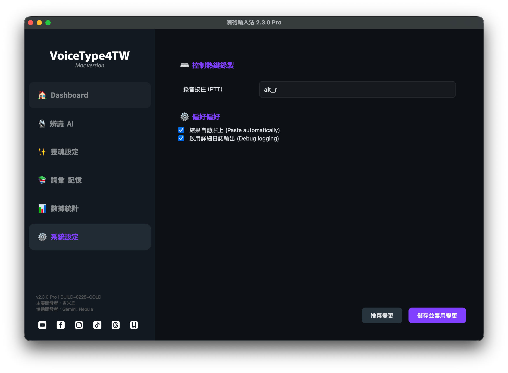

# VoiceType4TW - Mac 嘴炮輸入法

主要開發者：吉米丘  
協助開發者：Gemini、Nebula  

macOS本地語音輸入工具，按下快捷鍵開始講話，系統自動幫你辨識並輸入到任何應用程式裡面

---

## 為什麼做這套工具



靈感來自TypeLess這類語音輸入工具，但因為授權限制與雲端依賴，我就想：能不能做一套「完全可以在本地端自己掌握」的語音輸入工具  
於是就結合Apple Silicon的本地Whisper能力，再加上Gemini、Nebula等AI夥伴，一起打造出這套專為Mac打造的VoiceType4TW，也就是嘴炮輸入法

---



## 功能特色

- 全域快捷鍵觸發(可自訂)  
- Push-to-talk或Toggle兩種啟動模式  
- 本地Whisper語音辨識(faster-whisper，支援Apple Silicon加速)  
- 可選Groq API雲端辨識  
- 可選AI文字潤飾(Ollama / OpenAI / Claude)
- macOS Menu Bar控制  
- 浮動錄音狀態視窗(底部中央顯示目前狀態)  
- **Instant Translation 魔術語模式**：不用先進設定，只要用講的就能切換翻譯語言  
- **UI強化**：沉浸式置底狀態列、藍色模式前綴、自動置中佈局  
- **智慧詞彙學習**：自動學習你常講的專有名詞與關鍵字，提升辨識精準度  
- **不搶焦點設計**：深度調整macOS視窗屬性，錄音與輸出時，不會把游標焦點搶走  

---

## 浮動錄音狀態視窗



這裡有多種模式呈現

- 左側沒有AI的字樣，直接辨識、輸出
- 左側有AI的部分，透過LLM做修飾完成之後再輸出
- 黃色模式，當我們的語音講完之後，它就開始做辨識
- 翻譯成英文，當你直接講中文，它就會翻譯成英文
- 翻譯成日文，當你直接講中文，它就會翻譯成日文


---

## 靈魂設定


因為可以透過AI去做LLM的優化輸出，所以我也在上面加了一個靈魂檔案，讓你可以去注入你自己想要的個性跟內容來做輸出

---

## 詞彙記憶


因為吉米常常需要輸入一些專有名詞，或者是客戶的品牌名稱，所以我在這個地方設計了一個詞彙新增的功能，可以手動輸入我們想要辨識的專有名詞

甚至我這邊是設定了，當一個詞彙出現三次以上，他會自動把它記錄起來

因為有了「養龍蝦」觀念的經驗之後，我也希望它能夠擁有一個長期記錄

每一週，它會去把當週所有的記憶做一個濃縮之後再另存起來，讓它持續保有我們之前所有的記憶

我的想法是這樣子啦


---



## 魔術語指令 Magic Commands

你可以直接用語音啟動或關閉翻譯模式，螢幕會有閃光與音效提示目前狀態，或是在系統列上快速切換

### 啟動翻譯

說出以下類型指令，即會切換為翻譯模式，並將後續內容翻譯成指定語言：

- 「把下面這段話翻譯成英文」  
- 「以下內容翻譯成日文」  
- 「把內容翻譯成德文」  

### 恢復正常模式

想回到一般語音輸入模式時，可以說：

- 「恢復正常」  
- 「取消翻譯」  
- 「回到正常模式」  

---

## 數據統計



這套系統會記錄你輸入了多少語音，語音總長度是多少，然後再除以一般人平均每分鐘的打字字數，總結出幫你省下多少時間的統計。

希望讓大家長久使用下來，能夠看到一個漂亮的數據！

---

## 系統設定



設定成要按哪個按鈕來觸發語音輸入法的設定頁面。在這個地方可以按住錄音的呈現，錄音切換這個部分，我現在還在調整當中。強制AI處理這部分，其實我沒有MenuBar的選單就可以了。這部分我來修改一下好了。

結果自動貼上，這玩意兒就是會把我們輸入之後的文字，自動貼上我們所在Focus的視窗輸入頁面上面，同時也會存在剪貼簿裡面。

如果說它沒有出現的話，你只要直接按Ctrl-V貼上就可以了。

然後，如果你是喜歡看這個輸出結果的話，你可以啟用詳細一日制輸出，這個只有在Terminal的視窗上面會出現，這是我們在Debug的時候使用的。


---

## 工作流程

1. 按下你設定好的快捷鍵開始講話  
2. 系統透過本地Whisper或Groq雲端進行語音辨識  
3. 可選擇直接輸出文字，或先丟給LLM做潤飾、整理口氣、調整風格  
4. 輸出結果自動送回目前有輸入焦點的應用程式  
5. 若使用魔術語，則會在流程中自動進行翻譯後再輸出  

---

## 安裝

```bash
# 建議使用 Python 3.11+
pip install -r requirements.txt
```

---

## 設定

編輯 `config.json`：

| 欄位            | 說明                                                | 預設值          |
|-----------------|-----------------------------------------------------|-----------------|
| `hotkey`        | 快捷鍵(right_option / right_shift / right_ctrl / f13-f15) | `right_option` |
| `trigger_mode`  | 觸發模式(push_to_talk / toggle)                    | `push_to_talk`  |
| `stt_engine`    | 語音引擎(local_whisper / groq)                     | `local_whisper` |
| `whisper_model` | Whisper模型大小(tiny/base/small/medium/large)      | `medium`        |
| `groq_api_key`  | Groq API Key(使用groq引擎時填入)                  | `""`            |
| `llm_enabled`   | 是否啟用AI文字潤飾                                 | `false`         |
| `llm_engine`    | LLM引擎(ollama / openai / claude)                  | `ollama`        |
| `language`      | 辨識語言                                           | `zh`            |

---

## 執行

```bash
python main.py
```

首次執行需在：

> 系統設定 > 隱私權與安全性 > 輔助使用  

將終端機(或你使用的執行工具)加入允許清單，讓程式可以模擬鍵盤輸入

---

## 系統需求

- macOS 12+  
- Python 3.11+  
- Apple Silicon 或 Intel Mac  

---

## 支援與回饋


如果你覺得嘴炮輸入法對你有幫助，歡迎：

- 在GitHub按顆星支持  
- 分享給身邊常需要打字、開會做紀錄、寫文件的朋友  
- 請吉米喝杯咖啡、小額贊助，支持持續開發  

有任何功能建議、Bug回報、或想一起共創的點子，都可以：

- 直接在GitHub開Issue  
- 透過吉米的SNS管道來找我聊聊  
